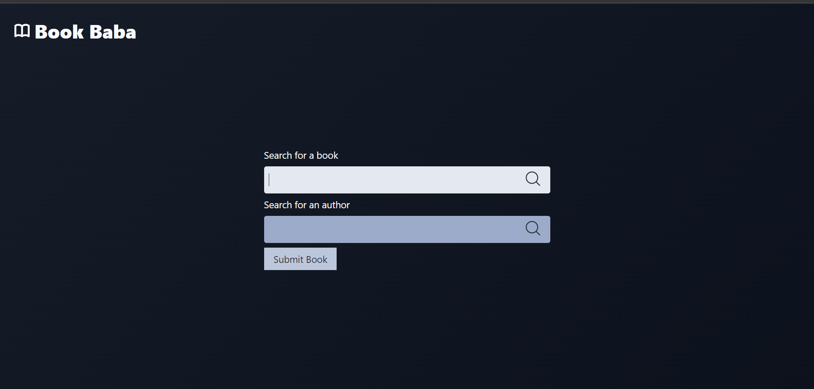
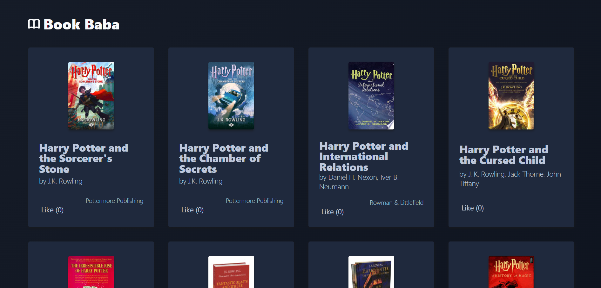

# Book BABA


A Django app which uses the Google Books API to allow a to user search for and see information about books.

This has been quite the challenge for me - I have little more than beginner Python, and have never used it for the web. I've also never written a Django app before, so this has been a huge learning curve!

## Running locally

To install:

* clone this repo
* in your terminal, run:
  
``` sh
> brew install python3 #if you don't already have python3
> python3 -m pip install -r requirements.txt
```

To run locally:

  ``` sh
  > python3 manage.py runserver
  ```

To test:

  ``` sh
  > python3 manage.py test
  ```

I've provided a .env.example file in the bookbrowse folder - to use the app you will need to rename this to .env and add your own environment variables.


## Backend API (Django REST Framework):
This application does not currently utilize a separate backend API (like Django REST Framework) but focuses on user interaction through the web interface. However, you can extend the functionality by implementing a REST API for managing book data programmatically.

## Frontend API

Search Books:

Endpoint: / (homepage)

Method: GET

Request Parameters:

search (optional): Search term for book title (string)

author (optional): Search term for author name (string)

Response Format: HTML page displaying search results (if any)


Search for Books:

Visit the homepage (/) with optional search parameters in the URL:

/search/?search=The+Lord+of+the+Rings

/search/?author=J.R.R.+Tolkien


Access the submit book page (/submit-book/).

Fill out the form with book title and author information.
Click the "Submit Book" button.


## Interactive API Documentation Tools:
While Django REST Framework provides built-in API documentation tools like browsable API and OpenAPI schema generation, these are not currently implemented in this project. If you choose to extend the functionality with a REST API, consider using tools like Swagger or Postman for interactive API documentation and testing.

## Features I'd like to add

- [x] Search by author
- [ ] Search by genre
- [ ] Filter / sort functionality
- [ ] 'Favourite' books
- [ ] Autocomplete on search

